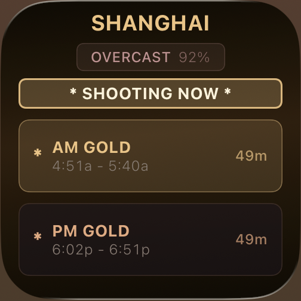
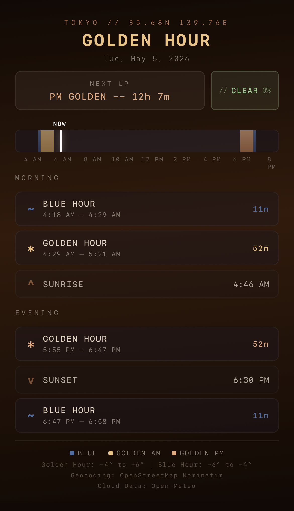
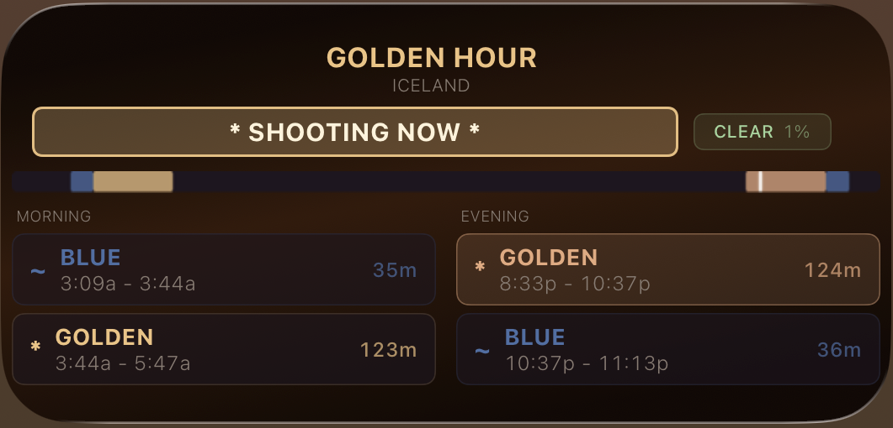

# Golden Hour

A home screen widget for iOS that shows today's golden hour and blue hour times for any city.

Built with [Scriptable](https://scriptable.app).

---

## What It Does

- Calculates golden hour and blue hour windows using solar position math
- Draws a color-coded timeline bar with a live NOW marker
- Shows a countdown to the next shooting window
- Displays morning and evening times in card-style columns
- Tap the widget to open a full-screen visual with detailed breakdown

---

## Preview

| Widget                              | Full View                     |
| ---------------------------------   | ----------------------------- |
|  |                               |
|                                     |  |
|  |                               |

---

## Setup

**1 -- Install Scriptable**

Download [Scriptable](https://apps.apple.com/app/scriptable/id1405459188) from the App Store.

**2 -- Add the script**

Copy `Golden Hour.js` to your iCloud Drive:

```
iCloud Drive / Scriptable / Golden Hour.js
```

Or open Scriptable, tap **+**, and paste the contents of the file.

**3 -- Add a widget**

- Long press your home screen
- Tap **+** --> search **Scriptable** --> choose **Medium** size
- Long press the new widget --> **Edit Widget**
- Script: **Golden Hour**
- When Interacting: **Run Script**

---

## City Configuration

There are three ways to set your location.

**Widget parameter** -- type a city name in the widget's Parameter field:

```
Tokyo
```

**In-app prompt** -- tap the widget or run the script in Scriptable to get a city input dialog.

**GPS fallback** -- leave the parameter blank and it uses your phone's current location.

Geocoding is handled by [OpenStreetMap Nominatim](https://nominatim.openstreetmap.org) (free, no API key needed). Results are cached in iCloud so the widget doesn't re-geocode on every refresh.

---

## How It Works

Sun positions are calculated using the NOAA solar equations. Four elevation angles define the windows:

```
Golden Hour    -4 deg  to  6 deg
Blue Hour      -6 deg  to -4 deg
Sunrise/Set         -0.833 deg
```

All times are converted from UTC using the device's local timezone automatically.

---

## File Structure

```
Golden Hour.js     The full Scriptable script (widget + visual)
README.md          This file
screenshots/       Widget and full view previews
```

---

## Requirements

- iOS 14+
- [Scriptable](https://scriptable.app) app (free)

---

## Credits

Solar calculation based on the NOAA sunrise/sunset algorithm.

Geocoding powered by OpenStreetMap Nominatim.
